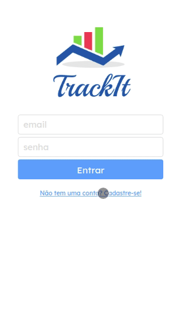

# Trackit

An easy to use habit manager where you create your habits, deciding which days will be done and daily monitor the progress and record of each.



Try it out now at https://trackit-omega.vercel.app/

## Features

This is an application where you can save all your habits and keep track of how often they are done. Below are the implemented features:

- Register user
- Access you account
- Create new habits
- View all your habits
- View and check ou uncheck your habits of the day
- Track your progress of habits made on the day

## Technologies
The following tools and frameworks were used in the construction of the project:<br>

  &nbsp;
  &nbsp;
  &nbsp;
  &nbsp;
  &nbsp;
  &nbsp;
  
## How to run

1. Clone this repository
2. Install dependencies
```bash
npm i
```
3. Run with
```bash
npm start
```
4. You can optionally build the project running
```bash
npm run build
```
5. Finally access http://localhost:3000 on your favorite browser (unless it is Internet Explorer. In this case, review your life decisions)